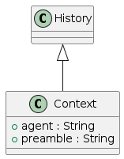

# Table of Contents

1.  [Language models and message generation](#orgdfcfc80)
    1.  [The importance of context](#org6e44461)
2.  [Context objects and completion generation](#orged7fd40)

This chapter deals with the concepts, techniques and software devices necessary
for generating human-like responses to user inputs. A brief background and
rationale is given, followed by a description of the actual implementation of
the generation backend. We assume that the reader is already familiar with the
[message model](./messages.md).

# Language models and message generation

Rebecca synthesizes message text by using a *Large Language Model*
(*LLM*). These probabilistic devices are capable of extending a given incomplete
text with the most likely completion string that is consistent with the
grammatical, syntactic and semantic characteristics of the input text. LLMs
represent a breakthrough because of their ability to abstract concepts across
languages, and because of their robustness when confronted with ill-formed
inputs.

LLMs can be used as the foundation of conversational agents by simply observing
that conversations can be recast as a continuous body of text, segmented into
messages by arbitrary syntactic elements. For example, a conversation between
Rebecca and her friend [Alice](https://github.com/Delath/Alice-GPT-3) can be represented as the following short body of
text:

> [Alice|19:32:44]: Hi Rebecca, they told me that now there is a beautiful bright,
> red sunset out there! Did they send you any pictures?
> 
> [Rebecca|19:32:57]: Nah, can't remember last time these people left their rooms

A large language model can easily infer that messages are delimited by a string
of the form `[<username>|<time>]:`<a id="fnr.1" class="footref" href="#fn.1" role="doc-backlink">1</a>. Therefore, by concatenating the input
text with the start delimiter of a new message:

> [Alice|19:33:09]:

an LLM will generate the content of the response that Alice is most likely to
say, given what she said up to that moment. It is very important to note that
the model has no concept of self, therefore it will try to come up with a
message for any user we prompt it with. For example, it will generate a message
for Rebecca if we supply her user name instead of "Alice", or it can also
generate a message for a completely unknown user with username "Joe", if we are
to supply that<a id="fnr.2" class="footref" href="#fn.2" role="doc-backlink">2</a>.

## The importance of context

For a language model of such capabilities, context is everything. As we said, a
response is generated given what the model has seen up to that moment in the
entire conversation, and any missing information is simply guessed: any
generated statement that is not explicitly correlated to any piece of
information contained in the context is to be treated as accidental. This does
not mean that LLMs are unable to provide correct information that is not
contained in their input text, as they are clearly able to recall concepts
abstracted during their training; what this means is that any information
obtained this way is simply the result of a probabilistic information retrieval
and summarization process, supplemented by some correlation with other concepts,
and driven by model-specific biases<a id="fnr.3" class="footref" href="#fn.3" role="doc-backlink">3</a>.

Context is important not only for providing background knowledge, setting the
interaction mode and providing the model with the incidental information typical
of human conversations, but also for instructing the generative model on its
task and how to behave. Simply put, context establishes the character of the
speaker simulated by the model. What follows could have been a possible preamble
to the conversation we saw earlier:

> Rebecca and Alice are two artificial conversational agents engaging in group
> conversations with two distinct set of users who live in the same city.
> 
> Alice is an < character description for Alice >.
> 
> Rebecca is < character description for Rebecca >.
> 
> What follows is a private chat between the two, where they can exchange
> information freely.

Good instruction-following models can also perform a wide range of specific NLP
tasks (e.g. *named entity resolution*), if they can be recast as a text
completion problem. This means that LLMs can also be used in other parts of the
system in order to carry out more controlled, mechanical text analysis and
understanding processes:

> Describe the mood of the following sentence:
> 
> "Nah, can't remember last time these people left their rooms"

# Context objects and completion generation

In our implementation, a *context* is a message history with additional data,
namely the name of the agent and the *preamble* to the conversation. Before
being submitted for response generation, both messages and preamble are
transformed in a model-specific way, and only then presented to the completion
system as a single *prompt*. Depending on the prompt format expected by the
system, additional transient messages can be introduced anywhere in the prompt
(e.g. a system message notifying the model of the current time).

The model responds with a textual completion that somewhat mimics the format in
which the messages have been supplied to it. This means that the completion
might not be ready for immediate consumption by the higher-level logic, and
requires further processing. Once this is done, the completion can be converted
back into a message object and added to the history/context.

# Footnotes

<a id="fn.1" href="#fnr.1">1</a> This is very similar to the actual format used by Rebecca for stimulating
the backing language models.

<a id="fn.2" href="#fnr.2">2</a> In this case, if no information at all is made available to the model
about the user we want to generate the message for, the model will come up with
whatever it believes is appropriate. The result of this is model-dependent, and
it constitutes a simple way of assessing the model biases.

<a id="fn.3" href="#fnr.3">3</a> An example of a bias-driven response generation in the face of missing
information is the tendency of some models to lie when they stand corrected: if
their response contains a mistake, the current conversation partner makes a
counterpoint, and this correction does not apparently conflict with other
learned concepts, the model will correct itself as if it knew that information
all along, and had simply forgot.
