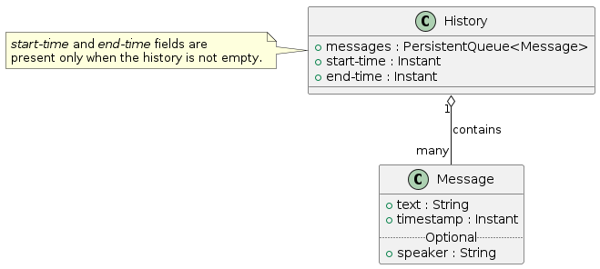

# Table of Contents

1.  [The message and history model](#org03f1a59)
2.  [Implementation](#orgfa5e4b4)

The topic of this chapter is that of *messages*, their representation and the
aggregation of messages into continuous time-ordered sequences known as
*histories*. We will begin with an explanation of the fundamental abstractions,
followed by some implementation considerations.

# The message and history model

The fundamental unit of unstructured knowledge is the *message*, informally
defined as "something said by someone at a certain point in time". Since Rebecca
is a conversational agent, the only way of communicating with interlocutors is
through these messages<a id="fnr.1" class="footref" href="#fn.1" role="doc-backlink">1</a>. Messages are immutable, they cannot be amended
once delivered to the system, but the information contained therein can surely
be retracted or enriched with subsequent messages, and the system should be able
to handle this time-varying state of knowledge at the higher levels of
abstraction. Some messages might come not from conversation partners, but can be
generated by the specific communication platform being used (e.g. online chat
service). This is the easiest way of notifying the agent and its intelligence of
changes in its virtual environment, and should not pose any limitation to its
capabilities<a id="fnr.2" class="footref" href="#fn.2" role="doc-backlink">2</a>.

Incoming messages are most naturally modeled as a stream of simple message
objects coming into the system from a multitude of external sources. Intervals
of messages in these streams can be substantiated into *history* objects,
chronologically-ordered sequences of concrete message objects. Histories can be
concatenated, and they naturally form a monoid with respect to
concatenation. New histories can be created by concatenating either messages or
other histories, and the empty history is a well-defined, single identity
element. Concatenating histories or messages with overlapping time frames or
time ranges, respectively, is illegal. Concatenating to the right a history or a
message that is older than the history on the left is illegal. What is legal to
concatenate to the left follows.

# Implementation

Messages can be implemented as a simple immutable object containing its string
representation, its creation timestamp and, optionally, a string identifying who
sent that message (*speaker*). When a message has no speaker, chances are that
it is a system message notifying the agent of a change in the environment. Any
additional information that has no relevancy for the immediate information
carried by the message (i.e. sentiment annotations, source-specific information
such as chat IDs) can be included in the metadata of message objects.

Histories contain messages in a queue. This allows for O(1) popping of old
messages and O(1) appending of new messages. Since no insertion is to be
explicitly supported by this data type, such implementation is adequate. When
not empty, histories also carry explicit information about the time frame they
cover, so that consistency checks for message appending and history
concatenation can be done in constant time. The empty history covers no time
range, therefore it lacks this information.

# Footnotes

<a id="fn.1" href="#fnr.1">1</a> Of course, we are open to suggestions for other channels of non-verbal
communication, like intonation annotations for speech recognition and synthesis,
or somatic component generation for dynamic avatars.

<a id="fn.2" href="#fnr.2">2</a> After all, human beings are notified of system state change in the very
same way.
